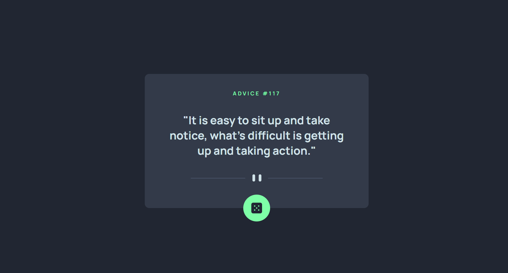
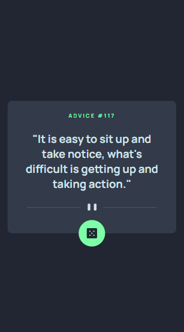

<h1>Advice generator app - Frontend Mentor</h1>

This is a Advice Generator App layout coded as an exercise for advanced HTML and CSS practicing, proposed by the course DevQuest by Dev em Dobro. The project is from <a href="https://www.frontendmentor.io/challenges/advice-generator-app-QdUG-13db">Frontend Mentor</a>.

<h2>Overview</h2>

<h3>The project</h3>

The aim of the exercise was to build the app's interface using HTML and CSS, as close as possible to Frontend Mentor's solution. The interface should be responsive to different screen sizes. JavaScript will be added after further course modules.

<h3>Preview</h3>
<h4>Desktop</h4>

<h4>Mobile</h4>

<h3>Link</h3>
<ul>
    <li>Live site URL: https://julianastahelin.github.io/advice-generator-app/</li>
</ul>

<h2>My process</h2>

<h3>Built with 👩🏽‍💻</h3>
<ul>
    <li>HTML 5;</li>
    <li>CSS 3.</li>
</ul>

<h3>What I learned 💪🏽</h3>
<ul>
    <li>Using CSS variables;</li>
    <li>Using absolute positioning;</li>
    <li>Positioning elements with CSS flexbox property;</li>
    <li>Using CSS transform property.</li>
</ul>        