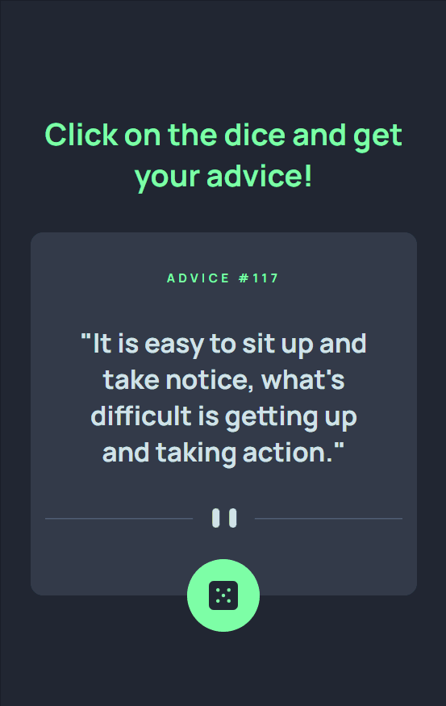

<h1>Advice generator app - Frontend Mentor</h1>

This is a responsive Advice Generator App coded as an exercise for advanced HTML, CSS and JS practicing, proposed by the course DevQuest by <a href="https://github.com/devemdobro" target="_blank">Dev em Dobro</a>. The project is from <a href="https://www.frontendmentor.io/challenges/advice-generator-app-QdUG-13db">Frontend Mentor</a>.

<h2>Overview</h2>

<h3>The project</h3>

The aim of the exercise was to build the app's interface using HTML and CSS, as close as possible to Frontend Mentor's solution. The interface should be responsive to different screen sizes. The project consumes an API for generating advice. The user should get a new advice every time the dice button is clicked.

I made a modification to the original design, adding a title to introduce the functionality.

<h3>Preview</h3>
<h4>Desktop</h4>

<h4>Tablet</h4>

<h4>Mobile</h4>

<h3>Link</h3>
<ul>
    <li>Live site URL: <a href="https://julianastahelin.github.io/advice-generator-app/">https://julianastahelin.github.io/advice-generator-app/</a></li>
    <li>Frontend Mentor - challenge: <a href="https://www.frontendmentor.io/challenges/advice-generator-app-QdUG-13db">https://www.frontendmentor.io/challenges/advice-generator-app-QdUG-13db</a></li>
    <li>Frontend Mentor - my solution: <a href="https://www.frontendmentor.io/solutions/responsive-advice-generator-consuming-api-7Gk-2bnq_F">https://www.frontendmentor.io/solutions/responsive-advice-generator-consuming-api-7Gk-2bnq_F</a></li>
</ul>

<h2>My process</h2>

<h3>Built with 👩🏽‍💻</h3>
<ul>
    <li>HTML 5;</li>
    <li>CSS 3;</li>
    <li>JS.</li>
</ul>

<h3>What I practiced 💪🏽</h3>
<ul>
    <li>Consuming and API with JS</li>
    <li>Using CSS variables;</li>
    <li>Using absolute positioning;</li>
    <li>Positioning elements with CSS flexbox property;</li>
    <li>Using CSS transform property.</li>
</ul>        